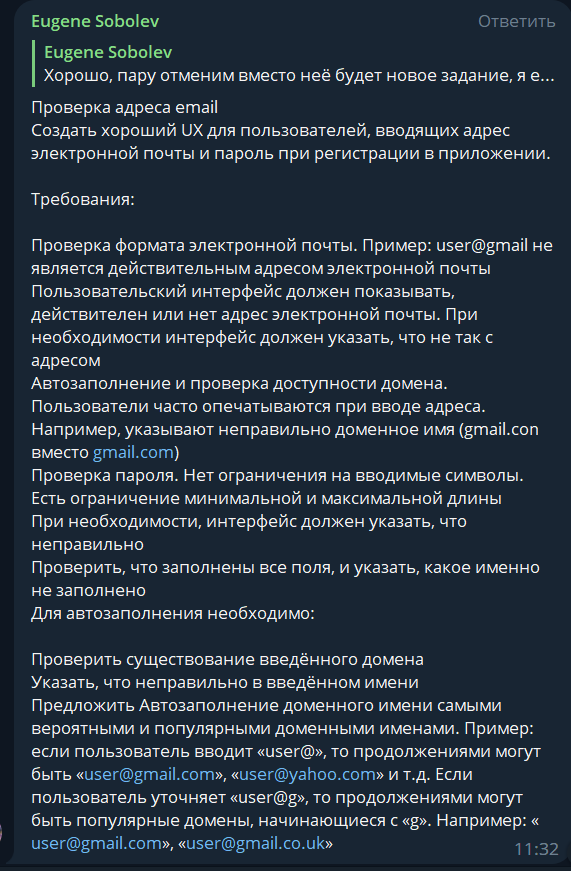
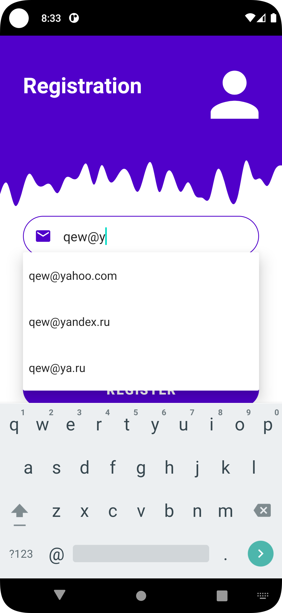
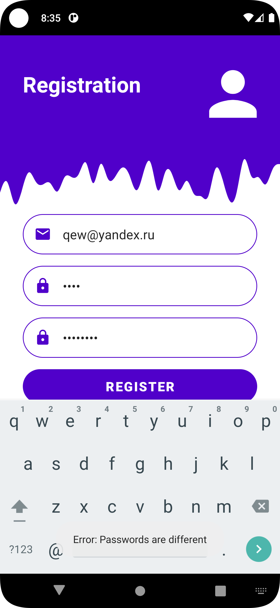
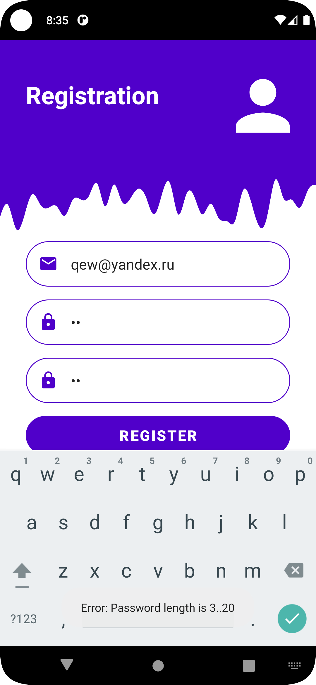
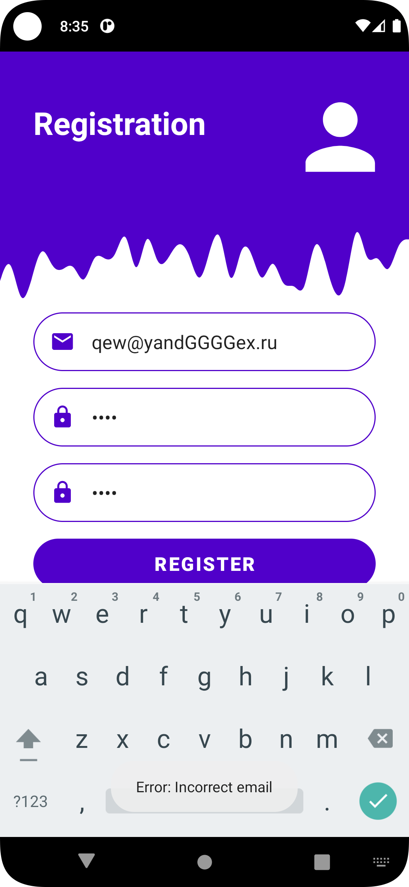
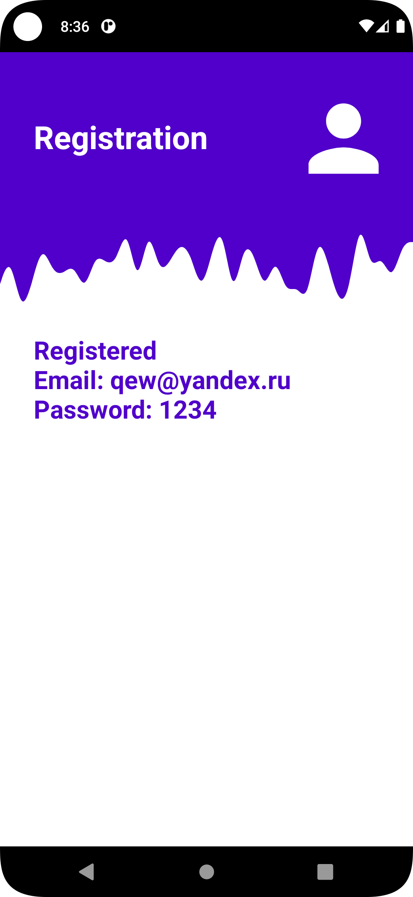

<p align = "center">МИНИСТЕРСТВО НАУКИ И ВЫСШЕГО ОБРАЗОВАНИЯ<br>
РОССИЙСКОЙ ФЕДЕРАЦИИ<br>
ФЕДЕРАЛЬНОЕ ГОСУДАРСТВЕННОЕ БЮДЖЕТНОЕ<br>
ОБРАЗОВАТЕЛЬНОЕ УЧРЕЖДЕНИЕ ВЫСШЕГО ОБРАЗОВАНИЯ<br>
«САХАЛИНСКИЙ ГОСУДАРСТВЕННЫЙ УНИВЕРСИТЕТ»</p>
<br><br><br><br><br><br>
<p align = "center">Институт естественных наук и техносферной безопасности<br>Кафедра информатики<br>Григораш Алексей Владимирович</p>
<br><br><br>
<p align = "center">Лабораторная работа<br>«<strong>Проверка адреса email</strong>»<br>01.03.02 Прикладная математика и информатика</p>
<br><br><br><br><br><br><br><br><br><br><br><br>
<p align = "right">Научный руководитель<br>
Соболев Евгений Игоревич</p>
<br><br><br>
<p align = "center">г. Южно-Сахалинск<br>2023 г.</p>
<br><br><br><br><br><br><br><br>

## Введение:
**Android Studio** — интегрированная среда разработки производства Google, с помощью которой разработчикам становятся доступны инструменты для создания приложений на платформе Android OS


## Задачи:

<!-- <div align="center">
    
</div> -->


Проверка адреса email Создать хороший UX для пользователей, вводящих адрес электронной почты и пароль при регистрации в приложении.

Требования:

Проверка формата электронной почты. Пример: user@gmail не является действительным адресом электронной почты Пользовательский интерфейс должен показывать, действителен или нет адрес электронной почты. При необходимости интерфейс должен указать, что не так с адресом Автозаполнение и проверка доступности домена. Пользователи часто опечатываются при вводе адреса. Например, указывают неправильно доменное имя (gmail.con вместо gmail.com) Проверка пароля. Нет ограничения на вводимые символы. Есть ограничение минимальной и максимальной длины При необходимости, интерфейс должен указать, что неправильно Проверить, что заполнены все поля, и указать, какое именно не заполнено Для автозаполнения необходимо:

Проверить существование введённого домена Указать, что неправильно в введённом имени Предложить Автозаполнение доменного имени самыми вероятными и популярными доменными именами. Пример: если пользователь вводит «user@», то продолжениями могут быть «user@gmail.com», «user@yahoo.com» и т.д. Если пользователь уточняет «user@g», то продолжениями могут быть популярные домены, начинающиеся с «g». Например: «user@gmail.com», «user@gmail.co.uk»

Создать хороший UX для пользователей, вводящих адрес электронной почты и пароль при регистрации в приложении.


## Решение:

<div align="center">
    
    
    
    
    
    
</div>


MainActivity.kt
```kt

package com.example.emailchecklab

//import kotlinx.coroutines.scheduling.DefaultIoScheduler.executor

import android.annotation.SuppressLint
import android.content.Intent
import android.net.ConnectivityManager
import android.os.Bundle
import android.provider.ContactsContract.*
import android.util.Patterns
import android.widget.*
import androidx.appcompat.app.AppCompatActivity
import androidx.core.widget.doOnTextChanged
import okhttp3.OkHttpClient
import okhttp3.Request
import okhttp3.Response
import okio.IOException
import org.apache.http.params.HttpConnectionParams
import org.apache.http.params.HttpParams
import java.net.*
import java.util.*
import kotlin.concurrent.thread
import java.net.HttpURLConnection
import java.net.URL
import okhttp3.Call
import okhttp3.Callback
import okhttp3.MediaType
import android.os.AsyncTask
import android.util.Log
import okhttp3.*
//import java.io.IOException

class MainActivity : AppCompatActivity() {

    private val INTERNET_PERMISSION_CODE = 100

    private lateinit var registButton: Button
    private lateinit var emailTextView: AutoCompleteTextView

    private lateinit var passwordTextEdit: EditText
    private lateinit var repeatPasswordTextEdit: EditText

    private val domains = listOf(
        "gmail.com",
        "yahoo.com",
        "msn.com",
        "hotmail.com",
        "outlook.com",
        "aol.com",
        "gmail.uk.com",
        "rambler.ru",
        "yandex.ru",
        "ya.ru",
        "bk.ru",
        "list.ru",
        "internet.ru",
        "lenta.ru",
        "mail.ru",
        "inbox.ru"
    )

    @SuppressLint("ResourceAsColor")
    override fun onCreate(savedInstanceState: Bundle?) {
        super.onCreate(savedInstanceState)
        setContentView(R.layout.activity_main)

        val client = OkHttpClient()

        registButton = findViewById(R.id.button_register)
        emailTextView = findViewById(R.id.email_EditText)
        passwordTextEdit = findViewById(R.id.password_EditText)
        repeatPasswordTextEdit = findViewById(R.id.password_EditText2)

        var adapter = ArrayAdapter(
            this, android.R.layout.simple_dropdown_item_1line, domains
        )

//        if (connectionCheck()) Toast.makeText(this, "Yes", Toast.LENGTH_SHORT).show()
//        else Toast.makeText(this, "No", Toast.LENGTH_SHORT).show()


        emailTextView.setAdapter(adapter)

        emailTextView.doOnTextChanged { _, _, _, _ ->
            val str = emailTextView.text.toString()
            if (str.contains("@")) {
                val dom = str.substringAfter("@")
                val filtered = domains.filter { it.startsWith(dom) }
                val emails = mutableListOf<String>()
                filtered.forEach() {
                    emails.add(str.replaceAfter("@", "") + it)
                }

                adapter = ArrayAdapter(this, android.R.layout.simple_dropdown_item_1line, emails)
                emailTextView.setAdapter(adapter)
                emailTextView.showDropDown()
            }
        }


        registButton.setOnClickListener {
            val email = emailTextView.text.toString()
            val password = passwordTextEdit.text.toString()
            val password2 = repeatPasswordTextEdit.text.toString()

            if (email.isEmpty()) this.emailTextView.setHint(R.string.fill_it)
            if (password.isEmpty()) passwordTextEdit.setHint(R.string.fill_it)
            if (password2.isEmpty()) repeatPasswordTextEdit.setHint(R.string.fill_it)


            val errorMessage = checkAllTextViews(email, password, password2)
            if (errorMessage != null) {
                Toast.makeText(this, "Error: $errorMessage", Toast.LENGTH_LONG).show()
            } else {
                LoginInfo.email = email
                LoginInfo.password = password
                startActivity(Intent(this, RegisteredActivity::class.java))
            }

        }


    }


    private fun connectionCheck(): Boolean {
        val connectivityManager = getSystemService(CONNECTIVITY_SERVICE) as ConnectivityManager
        val networkInfo = connectivityManager.activeNetworkInfo
        return networkInfo != null && networkInfo.isConnectedOrConnecting
    }

    private fun passwordLengthCheck(password: String): Boolean = password.length in 3..20
    private fun emailCheck(email: String): Boolean = domains.contains(email.substringAfter("@")) && Patterns.EMAIL_ADDRESS.matcher(email).matches()

    private fun checkAllTextViews(email: String, password: String, password2: String): String? {
        return if (!emailCheck(email)) "Incorrect email"
        else if (!domainCheck(email)) "Incorrect email"
        else if (email.isEmpty() || password.isEmpty() || password2.isEmpty()) "Fill all text views"
        else if (!passwordLengthCheck(password)) "Password length is 3..20"
        else if (!password.equals(password2)) "Passwords are different"
        else null
    }

    


    private fun domainCheck(email: String): Boolean {
        val domain = email.substringAfter("@")
        var res = true

        val task = CheckDomainTask(object: CheckDomainTask.OnDomainCheckedListener{
            override fun onDomainChecked(isValid: Boolean) {
                res = isValid
            }
        })
        task.execute(domain)
        Thread.sleep(1000)


        val client = OkHttpClient()

        val request = Request.Builder()
            .url("https://$domain")
            .build()

        client.newCall(request).enqueue(object : Callback {
            override fun onFailure(call: Call, e: IOException) {
                res = false
            }

            override fun onResponse(call: Call, response: Response) {

                if (response.isSuccessful) {
                    res = true
                } else {
                    res = false
                }
            }
        })


        return res


//        try {
//            URI("https://$domain")
//            return true
//        } catch (e: MalformedURLException) {
//            return false
//        }
//        return try {
//            val address = InetAddress.getByName("https://$domain")
//            address.hostAddress != address.canonicalHostName
//        } catch (e: Exception) {
//            false
//        }


//        return try {
//            val ipAddress = InetAddress.getByName("https://$domain")
//            !ipAddress.equals("")
//        } catch (e: Exception) {
//            false
//        }


//        if (!URLUtil.isValidUrl(domain)) {
//            Toast.makeText(this, "Invalid URL", Toast.LENGTH_SHORT).show();
//            return false
//        }
//        else return true


//        return try {
//            Socket().use { soc -> soc.connect(InetSocketAddress(domain, 25), 20000) }
//            true
//        } catch (ex: IOException) {
//            false
//        }


    }

    class CheckDomainTask(private val listener: OnDomainCheckedListener):
        AsyncTask<String, Void, Boolean>(){

        interface OnDomainCheckedListener {
            fun onDomainChecked(isValid: Boolean)
        }

        override fun doInBackground(vararg params: String): Boolean {
            val domain = params[0]
            val url = "https://$domain"
            val client = OkHttpClient()
            val request = Request.Builder()
                .url(url)
                .head()
                .build()

            try{
                val response: Response = client.newCall(request).execute()
                return response.isSuccessful
            } catch (e: Exception){
                e.printStackTrace()
            }

            return false
        }

        override fun onPostExecute(result: Boolean) {
            listener.onDomainChecked(result)
        }

    }


}

//    https://www.digitalocean.com/community/tutorials/okhttp-android-example-tutorial


```


LoginInfo.kt

```kt
package com.example.emailchecklab

import android.util.Patterns
import android.provider.ContactsContract.*
import android.provider.ContactsContract.CommonDataKinds.Email
import androidx.lifecycle.ViewModel

class LoginInfo : ViewModel() {
    companion object {
        var email = ""
        var password = ""
    }
}

```

RegisteredActivity.kt

```kt
package com.example.emailchecklab

import android.os.Bundle
import android.widget.TextView
import androidx.appcompat.app.AppCompatActivity
import androidx.lifecycle.ViewModelProvider
import androidx.lifecycle.ViewModelProviders

class RegisteredActivity: AppCompatActivity()  {

    private lateinit var registeredTextView : TextView

    override fun onCreate(savedInstanceState: Bundle?) {
        super.onCreate(savedInstanceState)
        setContentView(R.layout.activity_regist)

        registeredTextView = findViewById(R.id.registered_textView)
        registeredTextView.text = "Registered\nEmail: ${LoginInfo.email}\nPassword: ${LoginInfo.password}"
    }


}
```

## Вывод:
В ходе выполнения задач изучил автозаполнение с помощью AutoCompleteTextView